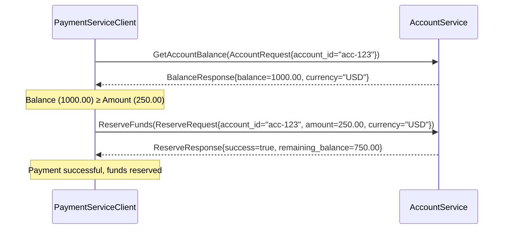
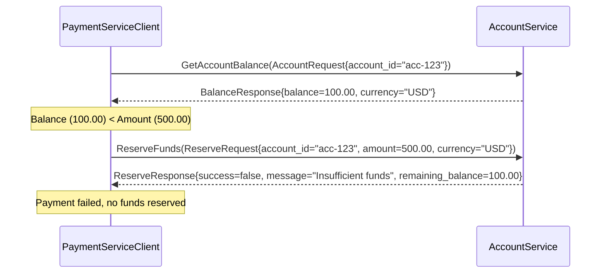
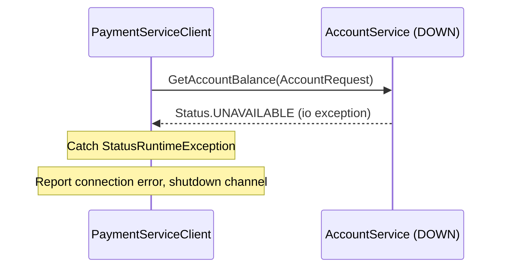

# Payment Service — Technical Architecture

## 1. System Overview

The Payment Service is a **gRPC client** application that communicates with the Account Service to check balances and reserve funds. Unlike the Account Service, it does **not** expose a gRPC server — it only makes outbound gRPC calls.

```
┌─────────────────────────────────────────────┐
│              Payment Service                 │
│                                              │
│  ┌──────────────────────────────────────┐   │
│  │      PaymentServiceClient.java        │   │
│  │                                        │   │
│  │  1. Create ManagedChannel              │   │
│  │  2. Create BlockingStub                │   │
│  │  3. Call getAccountBalance()            │   │
│  │  4. Call reserveFunds()                │   │
│  │  5. Display results to console         │   │
│  │  6. Shutdown channel                   │   │
│  └──────────────┬───────────────────────┘   │
│                  │                            │
└──────────────────┼────────────────────────────┘
                   │ gRPC / HTTP/2
                   │ (plaintext, port 50051)
                   ▼
┌──────────────────────────────────────────────┐
│              Account Service                   │
│            (gRPC Server)                       │
│                                                │
│  ┌──────────────────────────────────────┐     │
│  │    AccountServiceImpl.java            │     │
│  │    (extends AccountServiceImplBase)   │     │
│  └──────────────────────────────────────┘     │
└────────────────────────────────────────────────┘
```

## 2. Component Diagram

```
payment-service/
├── PaymentServiceClient.java     ← Main class (creates channel, stub, makes RPCs)
└── banking.proto                  ← Shared API contract (same as account-service)
        │
        │  protoc + grpc-java plugin
        ▼
┌─────────────────────────────────────────────────────────┐
│  Generated Code (build/generated/source/proto/)          │
│  ├── AccountServiceGrpc.java                             │
│  │     └── AccountServiceBlockingStub  ← Client uses    │
│  │     └── AccountServiceFutureStub                       │
│  │     └── AccountServiceStub                              │
│  ├── AccountRequest.java            ← Request message    │
│  ├── BalanceResponse.java           ← Response message    │
│  ├── ReserveRequest.java            ← Request message    │
│  └── ReserveResponse.java           ← Response message    │
└─────────────────────────────────────────────────────────┘
```

**Key difference from Account Service:** The Payment Service does **not** extend `AccountServiceImplBase`. Instead, it uses `AccountServiceBlockingStub` — the generated client stub — to make RPC calls to the Account Service.

## 3. Sequence Diagrams

### Successful Payment Flow



### Insufficient Funds



### Account Service Unavailable



## 4. Technology Stack

| Layer | Technology | Version |
|-------|-----------|---------|
| Language | Java | 17 |
| Build tool | Gradle | 8.x |
| RPC framework | gRPC | 1.59.0 |
| Serialization | Protocol Buffers | 3.24.0 |
| Transport | HTTP/2 (Netty client) | Shaded |
| Code generation | protobuf-gradle-plugin | 0.9.4 |
| Data store | None (stateless client) | — |

## 5. Key Design Decisions

### 5.1 Blocking Stub (Synchronous)

The Payment Service uses `AccountServiceBlockingStub` for simplicity:

```java
AccountServiceGrpc.AccountServiceBlockingStub stub =
    AccountServiceGrpc.newBlockingStub(channel);

// Synchronous call — blocks until response arrives
BalanceResponse response = stub.getAccountBalance(request);
```

**Why blocking?**
- Simple to understand and debug
- Appropriate for a CLI demo client
- No need for async callbacks in this use case

**Alternative:** `AccountServiceFutureStub` returns a `ListenableFuture` for async calls, and `AccountServiceStub` uses `StreamObserver` for full async streaming.

### 5.2 Plaintext Channel

For this demo, the gRPC channel uses **plaintext** (no TLS):

```java
ManagedChannel channel = ManagedChannelBuilder
    .forAddress("localhost", 50051)
    .usePlaintext()
    .build();
```

In production, you would use TLS:
```java
ManagedChannel channel = ManagedChannelBuilder
    .forAddress("account-service.example.com", 50051)
    .useTransportSecurity()
    .build();
```

### 5.3 Channel Lifecycle

The `ManagedChannel` is a long-lived object. Best practices:

1. **Create once** — at application startup
2. **Reuse** — for all RPC calls (channels are thread-safe)
3. **Shutdown gracefully** — at application termination

```java
Runtime.getRuntime().addShutdownHook(new Thread(() -> {
    channel.shutdown();
    try {
        channel.awaitTermination(5, TimeUnit.SECONDS);
    } catch (InterruptedException e) {
        channel.shutdownNow();
    }
}));
```

### 5.4 No Server Component

The Payment Service is a **pure client**. It does not:
- Listen on any port
- Expose any gRPC service
- Accept incoming connections

It only makes **outbound** gRPC calls to the Account Service.

## 6. Connection Configuration

| Property | Value | Notes |
|----------|-------|-------|
| Target host | `localhost` | Change for remote Account Service |
| Target port | `50051` | Account Service's gRPC port |
| Channel type | Plaintext | Use TLS in production |
| Stub type | Blocking | Synchronous, blocks until response |
| Timeout | Default (no deadline) | Add `.withDeadlineAfter()` in production |

### Adding Deadlines (Production Recommendation)

```java
// Recommended: set a deadline to avoid hanging forever
BalanceResponse response = stub
    .withDeadlineAfter(5, TimeUnit.SECONDS)
    .getAccountBalance(request);
```

## 7. Error Handling Strategy

The Payment Service handles errors at two levels:

### Level 1: Business Errors (in-band)

Handled by checking the `success` field in `ReserveResponse`:

```java
ReserveResponse response = stub.reserveFunds(request);
if (response.getSuccess()) {
    // Reservation succeeded
} else {
    // Business failure: check response.getMessage()
    System.err.println("Reservation failed: " + response.getMessage());
}
```

### Level 2: Transport Errors (out-of-band)

Handled by catching `StatusRuntimeException`:

```java
try {
    ReserveResponse response = stub.reserveFunds(request);
    // Handle business response
} catch (StatusRuntimeException e) {
    Status status = e.getStatus();
    switch (status.getCode()) {
        case UNAVAILABLE:
            System.err.println("Account Service is unreachable");
            break;
        case DEADLINE_EXCEEDED:
            System.err.println("Request timed out");
            break;
        default:
            System.err.println("gRPC error: " + status);
    }
}
```

## 8. Related Documentation

- [Account Service — Architecture](../../../account-service/docs/technical/architecture.md) — the server this client connects to
- [Code Generation](./code-generation.md) — how the client stubs are generated
- [gRPC vs REST](./grpc-vs-rest.md) — client-side comparison
- [Setup and Run](./setup-and-run.md) — how to build and run the client